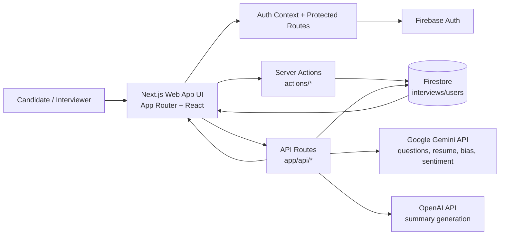

# FairHire — AI Interview Assistant

Deployed URL: https://v0-ai-interview-assistant-theta.vercel.app/

FairHire is a Next.js (App Router) web app that helps candidates practice interviews and helps teams run more structured, fairer interviews with AI-assisted feedback. It includes an interactive AI interview flow, resume/ATS analysis, interview tracking, and analytics-style signals like sentiment/engagement and bias alerts.

## Features

- **AI Interview Practice**
  - Configure an interview (position, difficulty, number of questions, interviewer “personality”)
  - Generate questions via an AI endpoint
  - Run an interactive session with progress tracking

- **Resume + ATS Analysis**
  - Upload/analyze resume data and compute an ATS-style score
  - Suggestions to improve resume alignment (based on parsed resume fields)

- **Interview Management**
  - Create, update, and delete interviews
  - Track interview status: `scheduled`, `in-progress`, `completed`, `cancelled`
  - Store transcripts, summaries, follow-up suggestions, and optional metadata (e.g., recording, AI interviewer)

- **Bias & Quality Signals (Model/Data Driven)**
  - Capture **bias alerts** (type, severity, explanation, suggestion)
  - Track **sentiment** and **engagement** metrics on an interview record

- **UI/UX**
  - Modern component system (Radix UI + Tailwind)
  - Theming support (`next-themes`)
  - Protected routes/auth context

## Tech Stack

- **Framework:** Next.js 15 (App Router) + React 19 + TypeScript  
- **UI:** Tailwind CSS, Radix UI components, `lucide-react` icons  
- **Forms/Validation:** React Hook Form, Zod  
- **AI:** `ai`, `@ai-sdk/openai`, `@google/generative-ai`  
- **Other:** Firebase (configured as a dependency)

## Project Structure (high level)

- `app/` — Next.js App Router pages and API routes  
  - `app/interviews/ai-interview/page.tsx` — AI interview flow page
  - `app/api/` — API routes (e.g., interviews, AI question generation)
- `components/` — UI + feature components (interactive interview, recorder, header, etc.)
- `actions/` — Server actions for interview CRUD (e.g., `actions/interview-actions.ts`)
- `lib/` — Types and core helpers (e.g., `lib/types.ts` defines `Interview`, `Resume`, etc.)

## System Architecture Diagram



## Getting Started (Local Development)

### 1) Install dependencies
```bash
npm install
```

### 2) Run the dev server
```bash
npm run dev
```

Open http://localhost:3000

### 3) Build for production
```bash
npm run build
npm run start
```

## Environment Variables

This project uses AI providers and Firebase, so you will likely need environment variables for:
- OpenAI / AI SDK keys
- Google Generative AI keys
- Firebase configuration

Create a `.env.local` file and add the required values for the providers you enable.

> Note: The exact variable names depend on your provider setup and implementation in `app/api/*`.

## Notes

- Some code search results are limited to the first 10 matches in the GitHub search UI; if you’re exploring more occurrences, use GitHub search directly:
  https://github.com/omkarbandikatte/aI_interview_prep-09/search

## License

Add a license if you plan to distribute this project (e.g., MIT).
